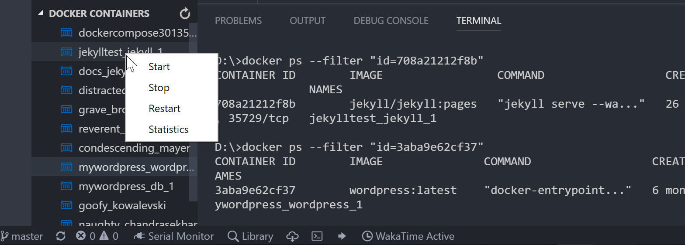

# Docker Explorer

[](https://gitter.im/formulahendry/vscode-docker-explorer?utm_source=badge&utm_medium=badge&utm_campaign=pr-badge&utm_content=badge) [](https://marketplace.visualstudio.com/items?itemName=formulahendry.docker-explorer) [](https://marketplace.visualstudio.com/items?itemName=formulahendry.docker-explorer) [](https://marketplace.visualstudio.com/items?itemName=formulahendry.docker-explorer) [](https://travis-ci.org/formulahendry/vscode-docker-explorer)

## Features

* Manage Docker Containers in Explorer

## Prerequisites

* [Docker](https://www.docker.com/) is installed

## Usage

* Manage Docker Containers in Explorer



## Telemetry data

By default, anonymous telemetry data collection is turned on to understand user behavior to improve this extension. To disable it, update the settings.json as below:
```json
{
    "docker-explorer.enableTelemetry": false
}
```

## Change Log

See Change Log [here](CHANGELOG.md)

## Issues

Currently, the extension is in the very initial phase. If you find any bug or have any suggestion/feature request, please join the chat on [Gitter](https://gitter.im/formulahendry/vscode-docker-explorer) or submit the [issues](https://github.com/formulahendry/vscode-docker-explorer/issues) to the GitHub Repo.
